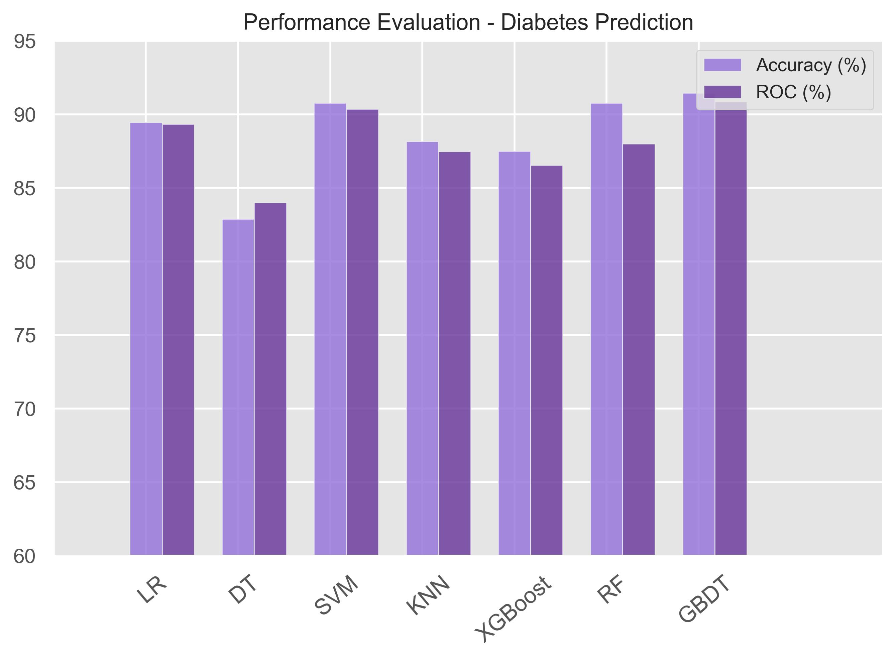
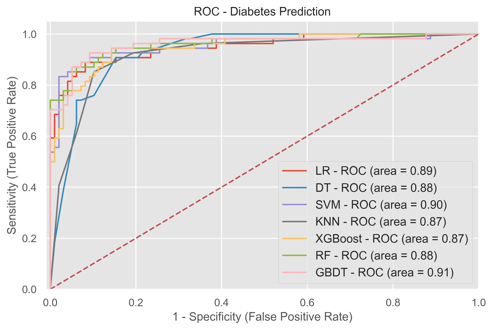

# Diabetes Prediction Project

This project is a web-based application designed to predict the likelihood of diabetes using a machine learning model. Built with **Django** and **Python**, it takes user inputs such as pregnancies, glucose levels, BMI, and age, and provides a prediction of **"Diabetes"** or **"No Diabetes"**.

---

## 🚀 Features

- User-friendly form to input health metrics.
- Machine learning model trained on diabetes dataset.
- Real-time prediction results displayed on the frontend.
- Performance evaluation and ROC visualization.

---

## ⚙️ Installation

1. Clone the repository:
   ```bash
   git clone https://github.com/yourusername/diabetes-prediction.git
   cd diabetes-prediction
   ```
2. Install dependencies:
   ```bash
    pip install -r requirements.txt
   ```
3. Apply database migrations:
   ```bash
   python manage.py migrate
   ```
4. Run the server:
   ```bash
   python manage.py runserver
   ```

### 💻 Usage

- Open your browser and navigate to http://127.0.0.1:8000/.
- Enter the required health metrics in the form.
- Submit the form to see the prediction result

### 📊 Model Evaluation

### Performance Evaluation



- This image shows the performance metrics of the diabetes prediction model.

# ROC Curve



- This curve represents the Receiver Operating Characteristic (ROC), highlighting the model’s ability to differentiate between positive and negative classes.
